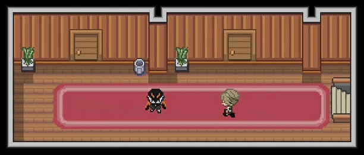
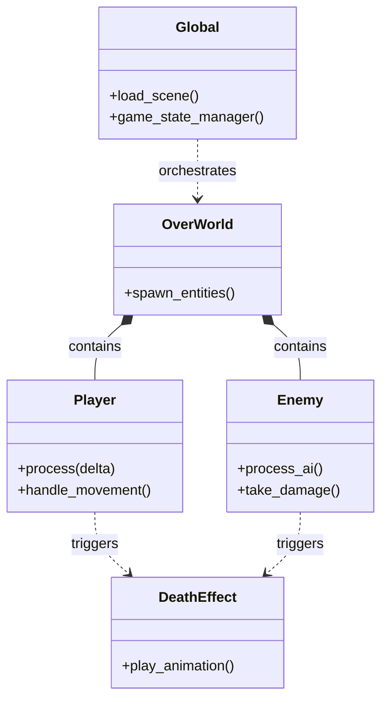

<div align="center">

# RPG Prototype

**A 2D action-RPG framework built with Godot 4.x**

[](https://godotengine.org)
[](https://docs.godotengine.org)
[]()

</div>

---
## V1 Demo (Old)

<div align="center">



</div>

---

##  Overview

A modular 2D RPG prototype featuring entity-component interactions, state management, and custom shaders. Designed as a lightweight foundation for top-down action-adventure games.

| Feature | Status |
| :--- | :--- |
| **Player Movement** |  Implemented |
| **Enemy AI** |  Basic State Machine |
| **Inventory** |  WIP |
| **Combat Effects** |  Shader-based |

---

##  Architecture

The project utilizes a singleton pattern for global state management (`global.gd`) to handle scene transitions and data persistence, while individual entities (`Player`, `Enemy`) encapsulate their own logic and visual effects.



---

##  Getting Started

1. **Clone the repository:**
   ```bash
   git clone https://github.com/JEmmanuelAbishai/rpg-prototype.git
   ```
2. **Open in Godot:**
   Open `project.godot` using the Godot Engine (4.x+ recommended).
3. **Run:**
   Press `F5` or the Play icon to launch the `OverWorld` scene.

---

##  Authors

**JEmmanuelAbishai**
[GitHub Profile](https://github.com/JEmmanuelAbishai)
```
